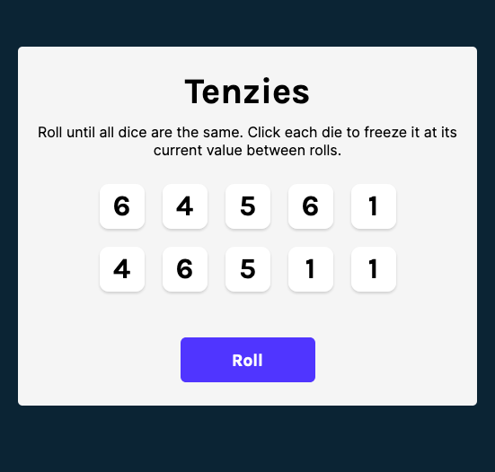
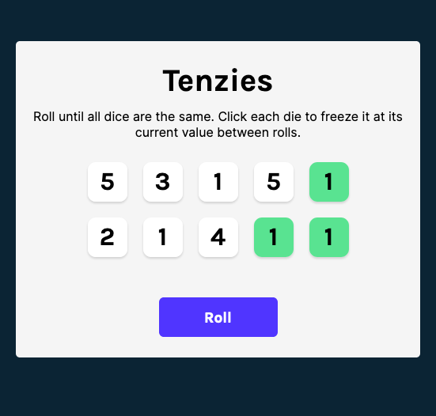
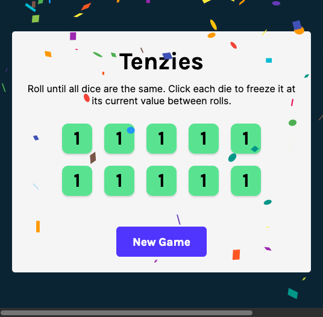

# Scrimba Frontend Career Path - (Tenzies - Module 11)

This is a solution to the [Scrimba Frontend Career Path - (Module11-React/Tenzies Game)](https://scrimba.com/learn/frontend).

## Table of contents

- [Overview](#overview)
  - [The challenge](#the-challenge)
  - [Screenshot](#screenshot)
  - [Links](#links)
- [My process](#my-process)
  - [Built with](#built-with)
  - [What I learned](#what-i-learned)
  - [Continued development](#continued-development)
  - [Useful resources](#useful-resources)
- [Author](#author)
- [Acknowledgments](#acknowledgments)


## Overview

### The challenge

Code the children's game Tenzies

After this Challenge I should be able to Code/Understand:

- React hooks (useEffect(), useState())
- Conditional reandering
- 3rd party libraries
- Pass functions as props
- useEffect() dependencies array

### Screenshot





### Links

- Solution Github URL: [https://github.com/Rod-Barbosa/tenzies-game](https://github.com/Rod-Barbosa/tenzies-game)
- Live Site URL: [https://rodrigo-tenzies-game.netlify.app/](https://rodrigo-tenzies-game.netlify.app/)

## My process

### Built with

- React
- nanoId, react-Confetti, 
- JavaScript

### What I learned

To simulate the button being pushed down. It isn’t the best for accessibility, but it gives an extra visual queue that things are being clicked.

```CSS
.roll-dice:focus {
    outline: none;
}

.roll-dice:active {
    box-shadow: inset 5px 5px 10px -3px rgba(0, 0, 0, 0.7);
}
```

On the App return statement, I used 2 instances of conditional rendering ( ternary operator ? : )
```React
    return (
        <main>
            {tenzies && <Confetti />}
            <h1 className="title">Tenzies</h1>
            <p className="instructions">Roll until all dice are the same. 
            Click each die to freeze it at its current value between rolls.</p>
            <div className="dice-container">
                {diceElements}
            </div>
            <button 
                className="roll-dice" 
                onClick={rollDice}
            >
                {tenzies ? "New Game" : "Roll"}
            </button>
        </main>
    )
```

For checking every dice in maintainable way, the array functopm .every(fn) fomes in handy. To check if the game has ended, 2 conditions take advantage of .every() all dice hold the same value and all dice are held.

```React
    React.useEffect(() => {
        const allHeld = dice.every(die => die.isHeld)
        const firstValue = dice[0].value
        const allSameValue = dice.every(die => die.value === firstValue)
        if (allHeld && allSameValue) {
            setTenzies(true)
        }
    }, [dice])
```


### Continued development

This game could use a timer, could use a move counter, a winning message,a 2 player display. 1000 different customizations.

### Useful resources

- [Original figma file](https://www.figma.com/file/FqsxRUhAaXM4ezddQK0CdR/Tenzies?node-id=0%3A1) - Always a good reference
- [Grid-template](https://developer.mozilla.org/en-US/docs/Web/CSS/grid-template) - Something si also going on with gap… just saying gap: 1em gives me a “warning”
- [React Confetti](https://github.com/alampros/react-confetti#readme) - High Production Value = Confetti Rain

## Author

- Website - [Rodrigo Portfolio](https://www.gelatodigital.com)
- Frontend Mentor - [@Rod-Barbosa](https://www.frontendmentor.io/profile/Rod-Barbosa)
- Github - [@Rod-Barbosa](https://github.com/Rod-Barbosa)

## Acknowledgments

